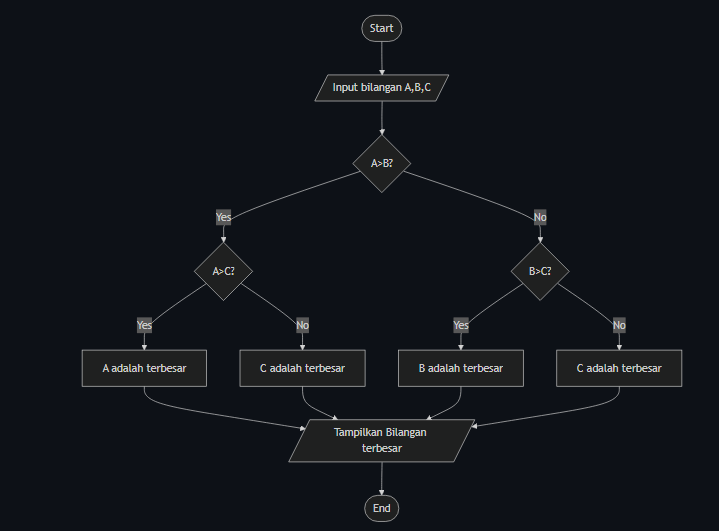

# Mencari Bilangan Terbesar dari 3 variable 
Program sederhana untuk menentukan bilangan terbesar dari tiga angka yang diinputkan pengguna.

## Deskripsi Program
Program ini akan:

1. Meminta user memasukkan 3 bilangan berbeda
2. Membandingkan ketiga bilangan tersebut
3. Menentukan bilangan mana yang terbesar
4. Menampilkan hasilnya ke layar

# flowchart Program



# kode Program

```python
nilai_terbesar = None

while True:
    angka = int(input("Input angka (0 untuk keluar): "))
    if angka == 0:
        break
    if nilai_terbesar is None or angka > nilai_terbesar:
        nilai_terbesar = angka

if nilai_terbesar is not None:
    print(f"Angka terbesar: {nilai_terbesar}")
else:
    print("Tidak ada angka yang dimasukkan.")
```
